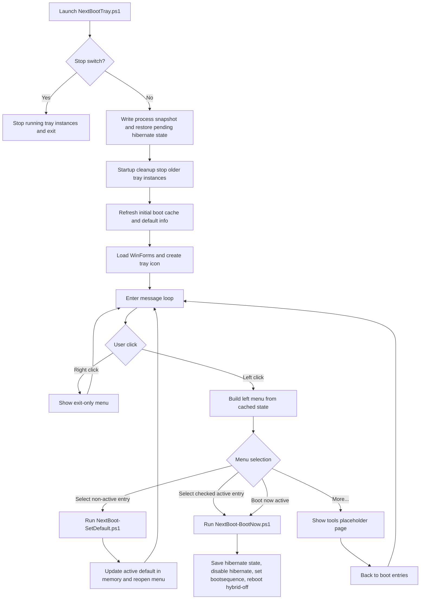

# NextBootTray - Design Flow & Architecture (v3.0.0)

## Overview

NextBootTray is a tray-first launcher for boot target control.

- Left-click opens a dynamic boot-action menu.
- Right-click exposes only an exit command.
- Boot entry data is read from `bcdedit` and cached in memory for repeated interactions.
- Hibernation resume entries (`winresume`) are classified as `Hibernation` and excluded from menu selection.
- A `More...` entry opens a tools placeholder page with back navigation.
- Actions are executed via helper scripts:
	- `NextBoot-SetDefault.ps1`
	- `NextBoot-BootNow.ps1`

## Runtime interaction model

1. Tray process starts, writes process-state/log snapshot, restores pending hibernation state if needed, and performs startup cleanup of older tray instances.
2. Tray icon becomes visible.
3. User left-clicks tray icon.
4. Menu is built from cached BCD/default state (cache is refreshed at startup or when explicitly forced).
5. User picks one of:
	 - `<entry>` (set as default)
	 - `Boot now: <active entry>`
	 - `More...` (tools placeholder page)

### Action behavior

- Selecting a non-active entry:
	- Runs `NextBoot-SetDefault.ps1 -Id <GUID>`
	- Updates active default selection in menu state
	- Reopens menu so `Boot now` remains immediately available
- Selecting the checked active default entry:
	- Runs `NextBoot-BootNow.ps1 -Id <GUID>`
- Selecting `Boot now: <active entry>`:
	- Runs `NextBoot-BootNow.ps1 -Id <GUID>`
- `NextBoot-BootNow.ps1` sequence:
	- Reads current hibernation state
	- Persists machine-scoped restore state file
	- Disables hibernation (`powercfg /h off`)
	- Sets one-time boot target (`bcdedit /bootsequence`)
	- Reboots with `shutdown /r /t 0 /hybrid-off`
- On next tray start:
	- `NextBootTray.ps1` restores hibernation state when a pending restore file exists for the current machine

## Flow diagram

## Notes

- BCD access requires elevation.
- Normal non-interactive startup is provided via elevated scheduled task (`NextBootTray-LogonElevated`) registered by installer.
- Diagnostics can be enabled with `-D`.
- Direct script diagnostics should use `-Detach` to avoid blocking the launching shell.
- Right-click intentionally does not show boot actions.
