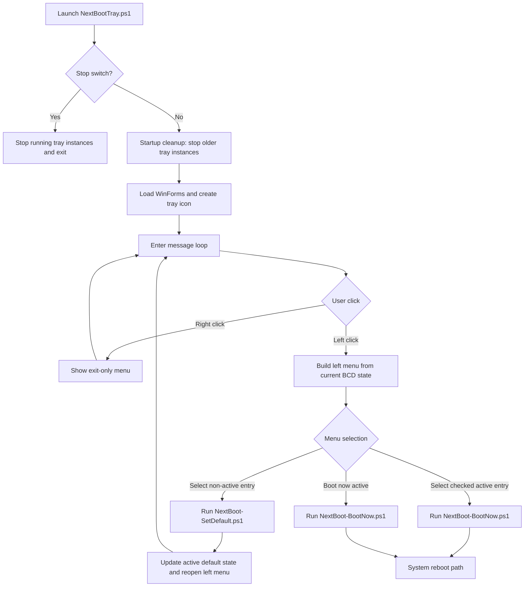

# NextBootTray - Design Flow & Architecture (v2.0.0)

## Overview

NextBootTray is a tray-first launcher for boot target control.

- Left-click opens a dynamic boot-action menu.
- Right-click exposes only an exit command.
- Boot entry data is read from `bcdedit`.
- Actions are executed via helper scripts:
	- `NextBoot-SetDefault.ps1`
	- `NextBoot-BootNow.ps1`

## Runtime interaction model

1. Tray process starts and performs startup cleanup of older tray instances.
2. Tray icon becomes visible.
3. User left-clicks tray icon.
4. Menu is rebuilt from current BCD entries/default state.
5. User picks one of:
	 - `<entry>` (set as default)
	 - `Boot now: <active entry>`

### Action behavior

- Selecting a non-active entry:
	- Runs `NextBoot-SetDefault.ps1 -Id <GUID>`
	- Updates active default selection in menu state
	- Reopens menu so `Boot now` remains immediately available
- Selecting the checked active default entry:
	- Runs `NextBoot-BootNow.ps1 -Id <GUID>`
- Selecting `Boot now: <active entry>`:
	- Runs `NextBoot-BootNow.ps1 -Id <GUID>`

## Flow diagram

## Notes

- BCD access requires elevation.
- Diagnostics can be enabled with `-D`.
- Direct script diagnostics should use `-Detach` to avoid blocking the launching shell.
- Right-click intentionally does not show boot actions.
